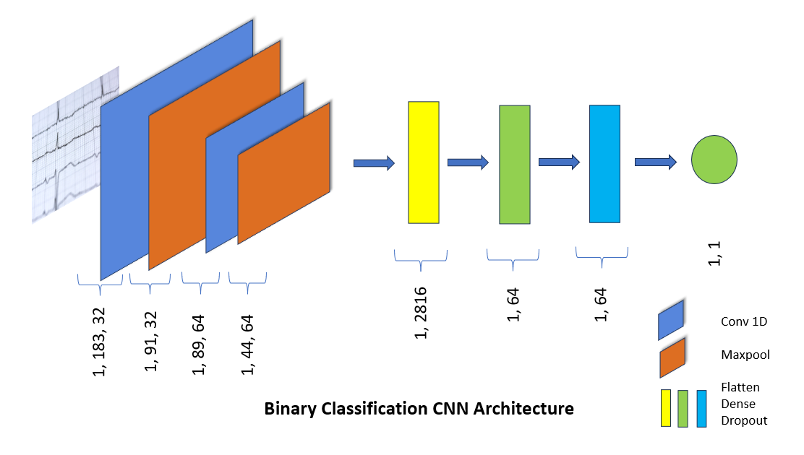

# ECG

## Overview
This is a machine learning-based project for classifying ECG signals using two different CNN architectures. The project uses the MIT-BIH dataset for training and testing the models, and a web application built using Streamlit for user input and prediction.

## Project Structure
* data: contains the MIT-BIH dataset used for training and testing the models
* models: contains the Python scripts for training and tuning the two CNN architectures
* deployment: contains the Streamlit web application code and the pickle files generated by the trained models
* ardtopy: contains the Arduino code for reading ECG signals and storing them in a CSV file

## CNN Architectures
### Architecture 1: Binary Classification (Normal vs. Abnormal)
This architecture uses a CNN model to classify ECG signals into two categories: Normal and Abnormal.

### Architecture 2: Multi-Class Classification (5 categories)
This architecture uses a CNN model to classify ECG signals into five categories: Normal, Supraventricular, Ventricular, Fusion, and Unknown.

## Model Training and Evaluation
The models were trained using the MIT-BIH dataset, and their performance was evaluated using metrics such as accuracy, precision, recall, and F1-score.

## Web Application
The trained models were used to generate pickle files, which were then deployed as a web application using Streamlit. The web application allows users to input their ECG signal data and receive a prediction from both models.

## How to Use
* Clone the repository and navigate to the deployment directory.
* Run streamlit run app.py to launch the web application in your default web browser.
* Enter your ECG signal data in the input field and click the "Predict" button to receive a prediction from both models.
## Arduino ECG
The Arduino code in the ardtopy file reads ECG signals from a sensor and stores them in a CSV file. The Python script in the ecg_signal_processing directory processes the ECG signals from the CSV file and prepares them as input for the trained models.
